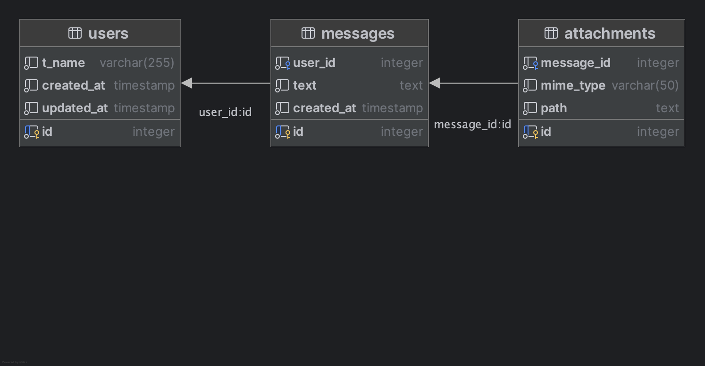

# tg-bot-listener

**tg-bot-listener** — это телеграм-бот, который слушает чат, сохраняет сообщения и пользователей в базу данных, а раз в неделю формирует краткую выжимку переписки с помощью LLM и отправляет её в чат.

---

## Возможности

- Сохраняет все текстовые сообщения из чата.
- Хранит пользователей и отслеживает изменение их имён.
- Раз в неделю (по расписанию) анализирует переписку и отправляет summary в чат.

---

## Структура проекта

```
tg-bot-listener/
│
├── main.py                      # Точка входа: запуск бота и планировщика
├── Dockerfile                   # Docker-образ для запуска
├── docker-compose.yml           # Компоновка сервисов (бот + postgres)
├── requirements.txt             # Зависимости Python
├── scr/
│   ├── bot/
│   │   ├── __init__.py
│   │   ├── bot.py               # Инициализация бота
│   │   ├── handlers.py          # Регистрация хендлеров сообщений
│   │   └── utils.py             # Вспомогательные функции
│   ├── config/
│   │   └── config.py            # Загрузка переменных окружения
│   ├── database/
│   │   ├── __init__.py
│   │   ├── db_service.py        # Работа с БД (CRUD)
│   │   ├── connection.py        # Подключение к Postgres
│   │   └── init.sql             # Миграции БД
|   ├── llm/
│   │   ├── client.py            # Подключение к n8n и получение результата от llm
│   └── scheduler/
│       ├── __init__.py
│       ├── scheduler.py         # Запуск планировщика (cron)
│       └── pipline.py           # Логика еженедельного анализа
└── README.md
```

---

## Быстрый старт

### 1. Клонируйте репозиторий

```bash
git clone <repo-url>
cd tg-bot-listener
```

### 2. Создайте файл `.env` в корне проекта

```env
TOKEN=ваш_telegram_bot_token
CHAT_ID=ваш_chat_id
DB_HOST=postgres
DB_USER=postgres
DB_PASSWORD=postgres
DB_NAME=postgres
DB_PORT=5432
WEBHOOK_URL=URL webhook n8n
```

### 3. Запустите через Docker Compose

```bash
docker-compose up -d --build
```

- Бот и база данных будут запущены в отдельных контейнерах.
- Миграции применяются автоматически при старте Postgres.

---

## Как работает

- **main.py**: запускает планировщик (APScheduler) и polling бота.
- **scr/bot/handlers.py**: регистрирует обработчики сообщений, сохраняет пользователей и сообщения, реагирует на текст.
- **scr/database/db_service.py**: все операции с БД (Postgres).
- **scr/llm/client.py**: соединение с llm в n8n, отправляет результат в pipline.py
- **scr/scheduler/pipline.py**: раз в неделю собирает сообщения, обрабатывает их (через LLM), отправляет summary в чат.
- **scr/config/config.py**: централизованная загрузка переменных окружения.

---

## Миграции

- Структура БД описана в `scr/database/init.sql`.
- При первом запуске контейнера Postgres миграции применяются автоматически.

